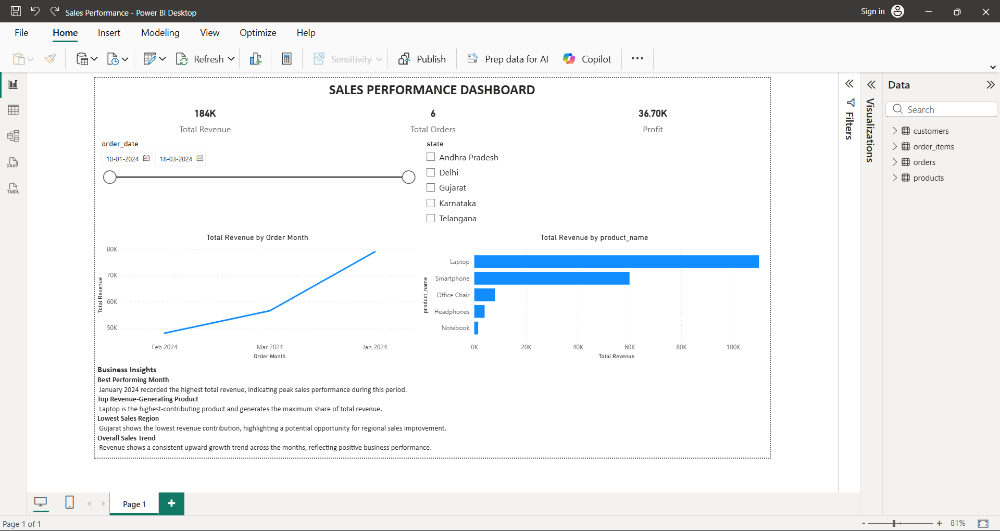

# Sales Performance Dashboard (Power BI)

## Business Problem
Analyze sales data to identify key trends, top-performing products, and regional performance to support better business decision-making.

## Project Overview
This project presents an interactive Sales Performance Dashboard developed using Microsoft Power BI.  
It enables analysis of revenue, orders, profit, and trends using dynamic visualizations and filters.

## Tools and Technologies
- Power BI Desktop  
- DAX  
- Data Modeling  
- Interactive Visualizations  

## Visualizations
- Line Chart: Total Revenue by Order Month  
- Bar Chart: Total Revenue by Product Name  

## Filters (Slicers)
- Order Date (Date Range)  
- State (Region)  

## Business Insights
- Sales increased steadily, reaching a peak in January 2024, indicating strong seasonal demand.  
- Laptops generated the highest revenue, making them the primary driver of overall sales performance.  
- Gujarat region recorded the lowest sales performance, highlighting an opportunity for targeted improvement.  
- The consistent upward trend indicates strong business growth and sustained market demand.  

## Dashboard Preview

## File Information
- Sales_Performance_Dashboard.pbix – Power BI dashboard file  
- screenshots/ – Dashboard preview images  
- data/ – Sample dataset 

## How to Use
1. Download the PBIX file  
2. Open it using Power BI Desktop  
3. Use slicers to explore the data interactively  

## Author
Rakesh Dabbikar
